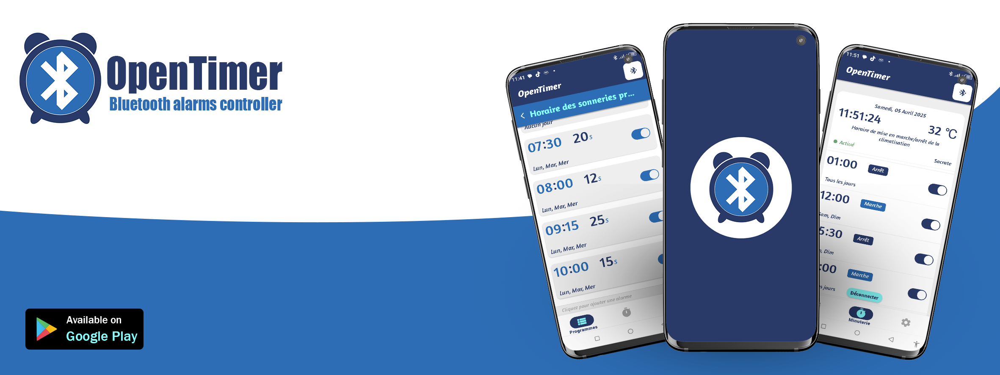
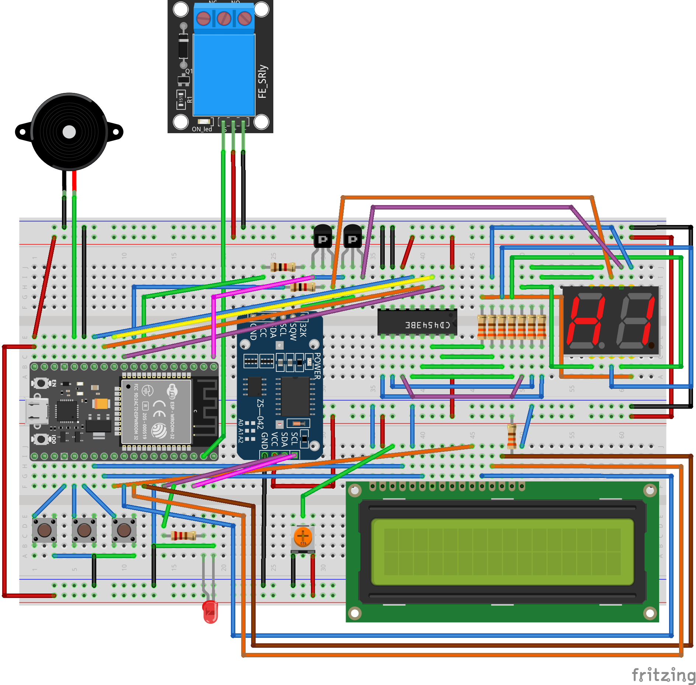

# Bluetooth alarm controller built with an ESP32 or an Arduino microcontroller

## This project is the ESP32 version

You can use this prototype circuit to build a custom alarm system secured with a password and controlled via an Android application(OpenTimer). This implementation supports two types of alarms (PRGI and PRGII).  
PRGI alarms are triggered at a specific time for a defined duration, whereas PRGII alarms are triggered to set an ON/OFF state. Therefore, PRGI can be used, for example, as a school bell timer, an alarm clock, a scheduled reminder, or a timed alert. PRGII can serve as a timer switch, a lighting control trigger, or an automatic equipment start/stop control.

## Features
* 40 alarms  
* Accurate real-time clock  
* Use of the microcontroller’s EEPROM for data persistence  
* Two program types (PRGI and PRGII) and additionnal info about program
* Security password  
* LCD menu with push buttons to view alarms  
* 7-segment display countdown  
* Request timeout LED  
* Buzzer  

# Download the Android client on the Play Store



# Installation instructions

## Build the example server circuit with the following components
* One breadboard  
* One buzzer  
* One DS3231 RTC module  
* 1k resistor  
* 2k resistor
* One 16x2 LCD display
* One 10k potentiometer
* One HC-05 Bluetooth module  
* Eight 330-ohm resistors  
* Three push buttons  
* One LED  
* Two 10k resistors  
* Two PNP transistors  
* One CD4543BE integrated circuit  
* One 2-digit 7-segment display
* One relay
* One ESP32



## Open VSCode, install the PlatformIO extension, clone this repository, and open the project


## Install all dependencies required for this project

## Increase the buffer size to at least 256 bytes
Not required for ESP32.

## Set the default password
Comment the first line of *main.cpp*:  
* Comment this macro: `#define RELEASE`.  

Then compile and upload the code to initialize the EEPROM with default values.

## Uncomment the first line of *main.cpp*, compile, and upload again

This time the main business logic will be installed.

## Pair the Bluetooth module with your smartphone and link it in the OpenTimer Android App

## You are now ready to go!

## (Optional) – Install a serial monitor extension and test the circuit by sending requests in hexadecimal format


# Serial Communication Protocol Documentation

*(Complete protocol documentation created by me for this project.)*

## Overview

This section describes the custom serial protocol used between the Arduino-based device and an external controller (PC or mobile app). The protocol allows configuration, data retrieval, password verification, and updates to internal EEPROM and RTC data.

Communication is byte‑oriented and synchronous: the controller sends a request, the device processes it and returns a response when required.

---

## General Communication Structure

### **1. Request Format**

Each incoming request has the following format:

```
[SIZE] [COMMAND][DATA] [COMMAND][DATA] ... [COMMAND][DATA]
```

* **SIZE** (1 byte): Total number of bytes that follow (COMMAND + DATA).
* **COMMAND** (1 byte): The instruction to execute.
* **DATA** (optional): Additional bytes depending on the command.

The Arduino reads `SIZE` first, then waits until the full request is received. If `DATA` doesn' t have a fixed lenght(string) the first byte is the lenght: [LENGTH][PAYLOAD]
Where:

* `LENGTH` = number of bytes in PAYLOAD
* PAYLOAD = content

### **2. Response Format**

If the command produces a response, the Arduino sends a response using the same request format:


If a buffer overflow occurs, the Arduino sends:

```
0x01 BUFFER_OVERFLOW
```

If a bad request is detected:

```
0x01 BAD_REQUEST
```

If a timeout occurs:

```
0x01 TIMEOUT
```
Where:

* `0x01` = lenght of request (1 byte)
---

## Timeout Behavior

If the full request is not received within a predefined number of seconds:

* A TIMEOUT error is returned
* The serial buffer is cleared
* A status LED is toggled

---

## Password System

Some commands require password verification.

### Password validation commands

* **POST_PASSWORD** → normal password validation
* **POST_PASSWORD_CHANGE** → validation before changing password
* **POST_PASSWORD_UPLOAD** → validation before uploading alarms

Password length: **32 bytes** (`PASSWORD_LEN`) sha256 of real password

### Response

```
[2][POST_PASSWORD_RESPONSE][response_code]
```

`response_code` may be:

* `PASSWORD_RESPONSE_INCORRECT` → incorrect
* `PASSWORD_RESPONSE_CORRECT` → correct
* `PASSWORD_RESPONSE_CHANGE` → correct (change password mode)
* `PASSWORD_RESPONSE_UPLOAD` → correct (upload mode)

If a password‑protected command is executed without successful validation, the request is ignored.

---

## Command List (Detailed)

Below is the full list of supported commands.

---

# **1. Connection Status**

### **CONNECTED**

* No data
* Server displays a "CONNECTED" message

### **DISCONNECTED**

* No data
* Server shows "DISCONNECTED"

---

# **2. EEPROM Configuration Commands**

## **2.1 Program Type**

### GET_PROGRAM_TYPE

**Response:**

```
[2][SET_PROGRAM_TYPE][programType]
```

### SET_PROGRAM_TYPE

Requires password.

```
[1][newProgramType]
```

---

## **2.2 Alarms**

### GET_ALARMS

Returns all alarms.

```
[1 + 4*N][SET_ALARMS][N*4 alarm bytes...]
```

Each alarm entry:

```
[hour][minute][duration][days]
```
```
[days]= bitmask of 8 boolean: Sun|Mon|Tue|Wed|Thu|Fri|Sat|AlarmState
```

### SET_ALARMS

Requires password.

```
[length][4*N bytes...]
```

Validation enforced:

* hour < 24
* minute < 60
* duration < 100

---

## **2.3 Description**

### GET_DESCRIPTION

```
[1 + len][SET_DESCRIPTION][length][chars...]
```

### SET_DESCRIPTION

Requires password.

```
[length][chars...]
```

---

## **2.4 Author**

### GET_AUTHOR

```
[1 + len][SET_AUTHOR][length][chars...]
```

### SET_AUTHOR

Requires password.

```
[length][chars...]
```

---

## **2.5 State**

### GET_STATE

```
[2][SET_STATE][state]
```

### SET_STATE

Requires password.

```
[1][state]
```

---

# **3. RTC (Real-Time Clock) Commands**

All RTC values match DS3231 registers.

## **3.1 Reading Time**

### GET_HOUR → returns RTC hour

### GET_MINUTE → returns RTC minute

### GET_SECOND → returns RTC second

### GET_DAY → date (1‒31)

### GET_MONTH → month (1‒12)

### GET_YEAR → year (00‒99)

### GET_DAY_OF_WEEK → (1=Sun, ..., 7=Sat)

### GET_TEMPERATURE → rounded temperature

---

## **3.2 Setting Time**

All require password.

### SET_HOUR

```
[1][hour 0–23]
```

### SET_MINUTE

```
[1][minute 0–59]
```

### SET_SECOND

```
[1][second 0–59]
```

### SET_DAY

```
[1][1–31]
```

### SET_MONTH

```
[1][1–12]
```

### SET_YEAR

```
[1][0–99]
```

### SET_DAY_OF_WEEK

```
[1][1–7]
```

---

# **4. Password Commands**

Explained above.

---

# Protocol Error Codes

| Code              | Meaning                            |
| ----------------- | ---------------------------------- |
| `BAD_REQUEST`     | Malformed packet or invalid value  |
| `BUFFER_OVERFLOW` | TX buffer capacity exceeded        |
| `TIMEOUT`         | Request not fully received in time |

---

# Example Exchanges

## Example 1: Read Current Hour

Client →

```
01 GET_HOUR
```

Server →

```
02 SET_HOUR HH
```

## Example 2: Set Minute (password protected)

Client →

```
35 POST_PASSWORD pwd[32] SET_MINUTE mm
```

Server →

```
02 POST_PASSWORD_RESPONSE 01
```

---

# Implementation Notes

* TX buffer size is **200 bytes**
* All values are raw binary (no ASCII)
* First byte **always** represents remaining size
* Requests with invalid length or fields jump to the `bad` label

---

# License

This protocol is proprietary to the project unless specified otherwise.

## Command Table

| Command ID               | Direction     | Description                                       |
| ------------------------ | ------------- | ------------------------------------------------- |
| `CONNECTED`              | Client → Server | Indicates a successful connection.                |
| `DISCONNECTED`           | Client → Server | Indicates a disconnection event.                  |
| `GET_PROGRAM_TYPE`       | Client → Server | Request the current program type.                 |
| `SET_PROGRAM_TYPE`       | Server → Client and Client → Server | Update or send the program type (password required if from Client).      |
| `GET_ALARMS`             | Client → Server | Request the list of alarms.                       |
| `SET_ALARMS`             | Server → Client and Client → Server | Update or send the alarm list (password required if from Client).        |
| `GET_DESCRIPTION`        | Client → Server | Request the device description.                   |
| `SET_DESCRIPTION`        | Server → Client and Client → Server | Update or send the description (password required if from Client).       |
| `GET_AUTHOR`             | Client → Server | Request author name.                              |
| `SET_AUTHOR`             | Server → Client and Client → Server | Update or send author name (password required if from Client).           |
| `GET_HOUR`               | Client → Server | Request the current hour.                         |
| `SET_HOUR`               | Server → Client and Client → Server | Set or send the hour (password required if from Client).                 |
| `GET_MINUTE`             | Client → Server | Request the current minute.                       |
| `SET_MINUTE`             | Server → Client and Client → Server | Set or send the minute (password required).               |
| `GET_SECOND`             | Client → Server | Request the current second.                       |
| `SET_SECOND`             | Server → Client and Client → Server | Set or send the second (password required if from Client).               |
| `GET_DAY_OF_WEEK`        | Client → Server | Request day of week.                              |
| `SET_DAY_OF_WEEK`        | Server → Client and Client → Server | Set or send day of week (password required if from Client).              |
| `GET_DAY`                | Client → Server | Request current day of month.                     |
| `SET_DAY`                | Server → Client and Client → Server | Set or send day (password required if from Client).                      |
| `GET_MONTH`              | Client → Server | Request month.                                    |
| `SET_MONTH`              | Server → Client and Client → Server | Set or send month (password required if from Client).                    |
| `GET_YEAR`               | Client → Server | Request year.                                     |
| `SET_YEAR`               | Server → Client and Client → Server | Set or send year (password required if from Client).                     |
| `SET_TEMPERATURE`        | Server → Client | Send temperature.                              |
| `GET_TEMPERATURE`        | Client → Server | Request temperature.                              |
| `GET_STATE`              | Client → Server | Request the alarms state(activated or not).                         |
| `SET_STATE`              | Server → Client and Client → Server | Update or send device state (password required if from Client).          |
| `POST_PASSWORD`          | Client → Server | Submit password to unlock write operations.       |
| `POST_PASSWORD_CHANGE`   | Client → Server | Validate old password before changing it.         |
| `POST_PASSWORD_UPLOAD`   | Client → Server | Validate password before uploading configuration. |
| `POST_PASSWORD_RESPONSE` | Server → Client | Response to password operations.                  |

# If you have any question contact me